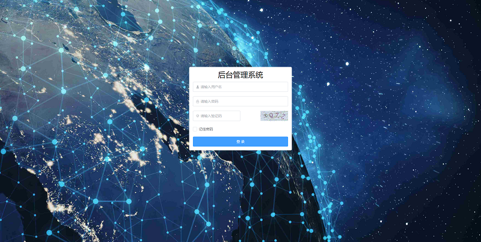
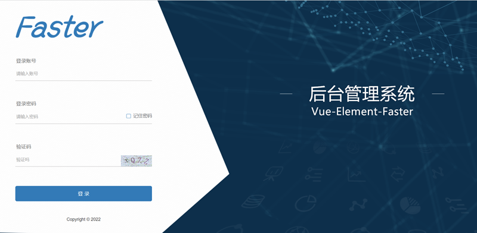
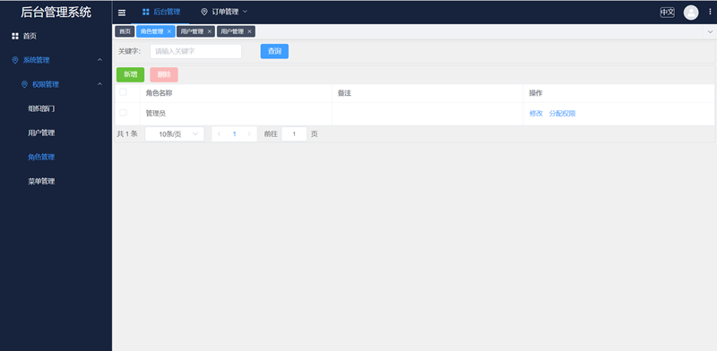
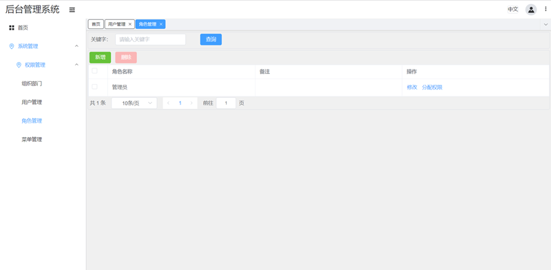
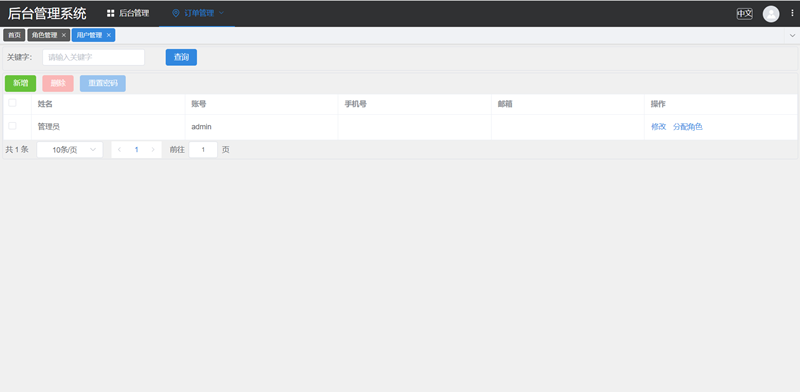
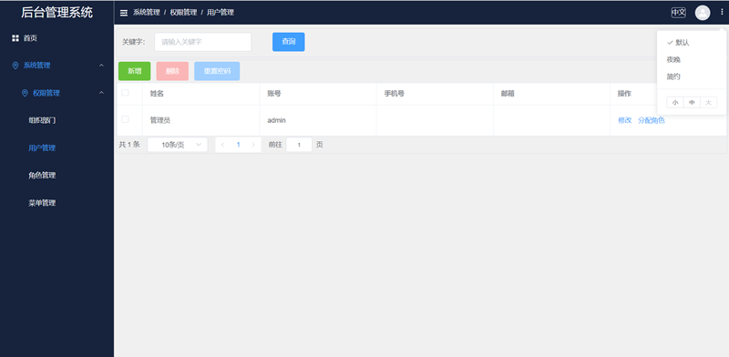
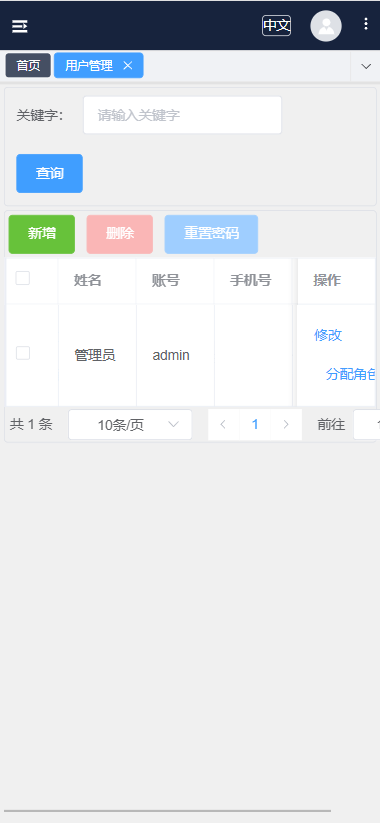
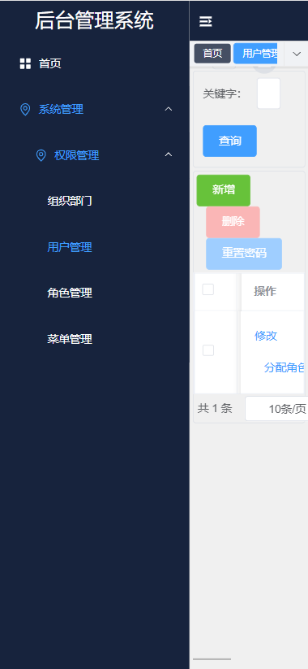

# vue-element-faster

## 介绍
* 基于最新版vue.js 3.x与element-plus2.x实现的一套后台管理模板，自带权限管理模块。
* API接口基于SpringBoot2.6.*, 技术栈包含SpringSecurity、Mybatis、Mysql5.7、Redis、RabbitMq、Swagger3.0+Knife4j、JWT等。
* 前后台依赖将不断跟进官方最新版本

## 功能介绍
* 国际化、路由等动态加载。
* 高度可配置化。主题，布局各组件等都可自由选择。
* 不同布局风格可作为前台展示系统或后台管理系统使用。
* 后端API代码一键下载。

### 功能列表
* 登录
* 登出
* 修改密码
* 主题及布局大小选择，可任意搭配布局组件（标签导航栏，面包屑，菜单位置等）
* 部门管理-新增、修改、删除
* 用户管理-新增、修改、删除、分配角色、重置密码
* 角色管理-新增、修改、删除、分配权限
* 菜单管理-新增、修改、删除、管理权限，权限-新增、修改、删除
* 后台代码下载-根据输入的groupId,artifactId,package等信息个性化导出后端JAVA代码
* 功能全部国际化处理
* 按钮级权限控制
* 完善的API接口管理，演示版支持使用模拟MOCK请求
* 网络带宽、前端算力、文件配置不断优化

### 开发中
* 编辑器
* 用户注册页
* 首页展示图表
* 外部链接菜单及iframe支持
* Excel导出/导入，打印

## 示例
### 演示地址
[演示地址Demo](https://vuemp.rexsheng.cn/)

### 登录页



### 后台默认布局，固定左侧菜单


### 固定顶部栏，同时显示菜单


### 前台系统布局


### 不同主题选择


### app1


### app2


## 开发指南

### 页面显示异常
由于element-plus 2.x版本目前不稳定，即使小版本之间升级也存在较多bug问题。建议将本地element-plus依赖更新为package.json中的版本

### 配置项
配置文件位于src/config目录下

-- src/config/request.js #接口请求配置项  
  -- src/config/system.js  #系统相关配置项  
  -- src/config/theme.js  #主题配置项  

### 自定义图标SVG
新图标文件放入src/assets/svg目录下，svg内容可参考 https://icon-sets.iconify.design  。  
组件使用`IconExtra+文件名`的方式来引入。  
例如图标文件名为`src/assets/svg/money.svg`，页面可直接使用组件`<IconExtraMoney />`

### 初始化项目
```
npm install
```

### 开发运行
```
npm run serve
```

### 编译打包
```
npm run build
```

### 编译打包并分析文件大小
```
npm run report
```


